[TOC]

# Comprehensive experiment report

## Subway route planning

### Participants and assignment 

| Name     | Student ID  | Workload |
| -------- | ----------- | -------- |
| ZHENG YU | 20213802028 | 100%     |

### Problem description and basic requirements

Basic tasks:

1. The system can provide the **shortest distance** route calculation and recommendation function
2. The system can provide the **least stations** route calculation and recommendation function
3. The system has UI interface and display
4. The route map formation can be restored in a files (`Guangzhou_railway.html`)
5. Enter the names of two sites to get their **shortest distance route, least stations route**
6. The route can be displayed with the path length (number of stations or distance)

Extended functions:

1. The system can provide the **least transit stations** route calculation and recommendation function
2. Enter the names of two sites to get their **least transit stations route**
3. The recommend route can **display as a map** on **browser** with **interaction** function
4. The route of system is **real time data** from baidu map
5. The route plan system can plan subway routes in **all cities in China** with change the `city_code` in Map class

### Tools and the knowledge used 

- The system use **adjacency list** to save station message as a **directed graph**.
- The system use **dijkstra** algorithm with **priority queue** to solve the shortest path problem of non-negative weight graph.
- The system use **pywebio** to display message and implement interaction function
- Development based on **VSCode** with **Conda** environment

### Analysis and implementation

data structures and algorithms choose:

- The requirement of task is planing a shortest route on subway railways with start and end stations. 
- Using **adjacency list** to load station message is suitable because its space complexity is $O(n)$ and it is especially good for sorting all the outgoing edges of a point.
- When the **priority queue** is used, if the shortest circuit of the same point is updated several times, the elements inserted in the previous update cannot be deleted or modified, but can only remain in the priority queue. Therefore, the number of elements in the priority queue is $O(m）$, and the time complexity is $O(m \log m)$.
- The subway line map is a **sparse map**. In sparse graph, $m=O(n)$, **Dijkstra** algorithm implemented by priority queue has greater efficiency advantage than Bellman-Ford algorithm; In a dense graph, $m=O(n^2)$, it is better to use brute force than priority queue.

function implement:

- Changing the weight of **dijkstra** algorithm can change the planing element between shortest distance and least station. The distance between two station is calculate by Mercator coordinates from baidu map.
- The UI interface is design by **pywebio** package, it can draw a interaction interface on browser with python code.
- The map of route display is using **plotly** package to display every element such as subway lines, subway stations, map of city and so on.
- The function of planing by least transit stations is implement by using **BFS** of graph with queue. 

### Testing and conclusion

A part of GZ subway graph

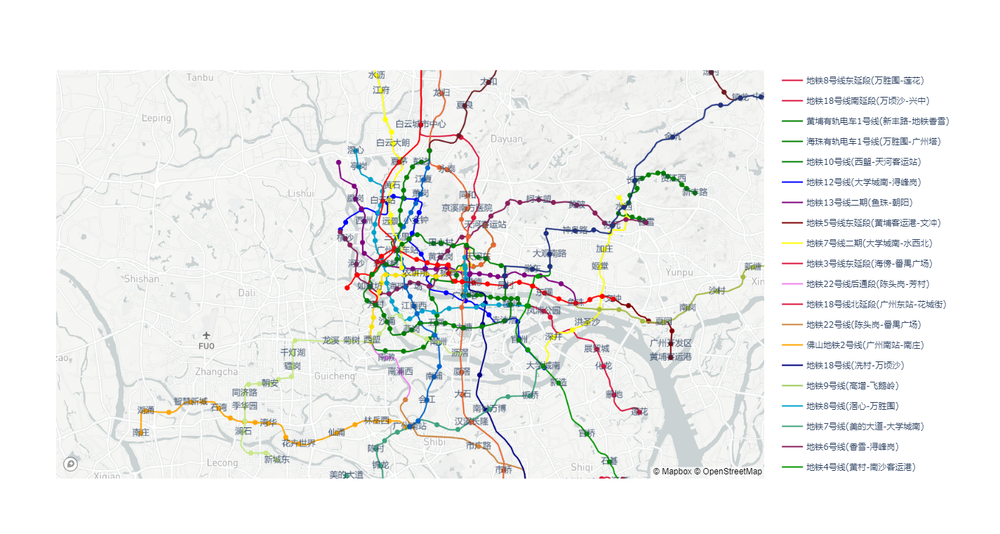

The input interface, you can input your start and end station.

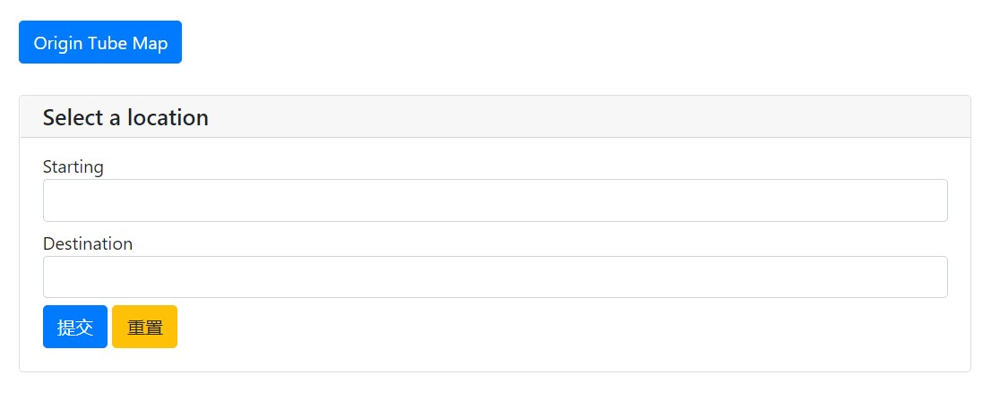

Select the station from drop-down box

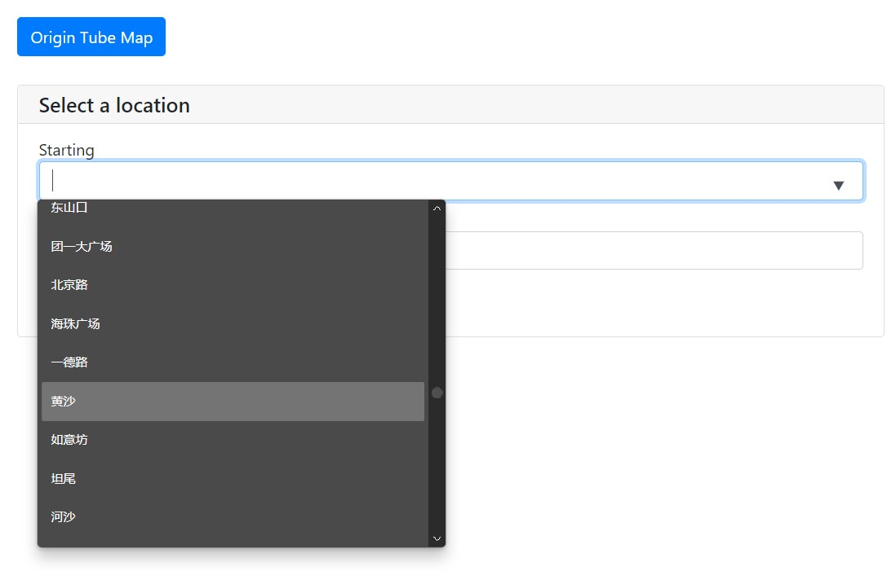

Select the station by typing

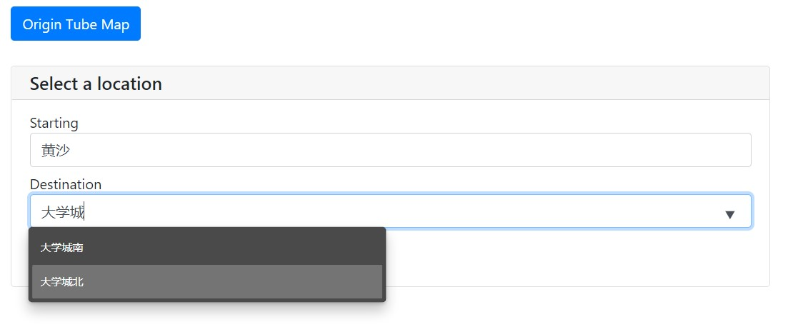

When you not sure the station name, you can click the blue button `Origin Tube Map` to check the real name from map.

Click the submit button

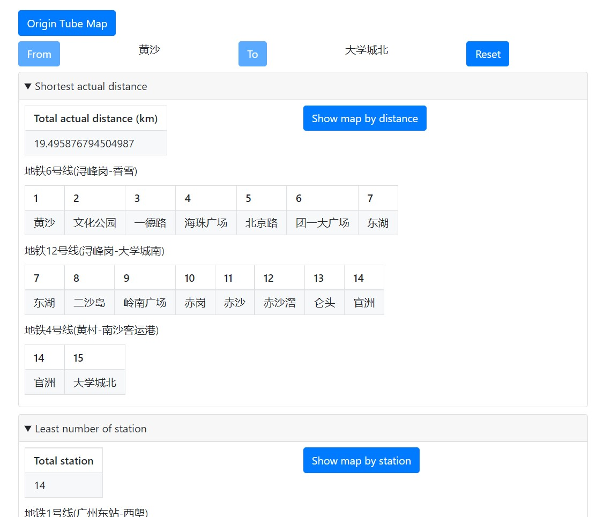

The frame like this

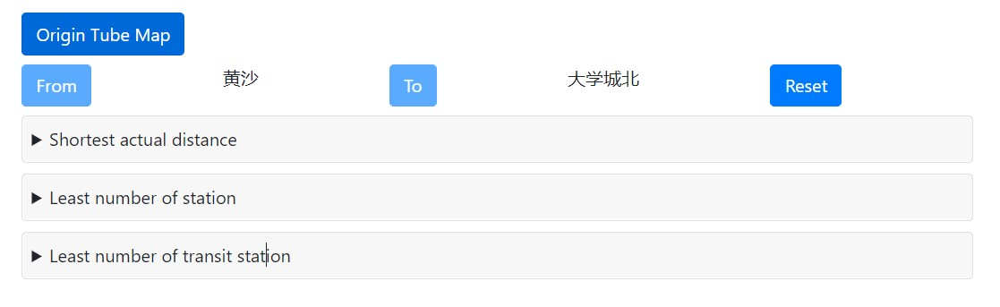

The shortest actual distance recommendation message

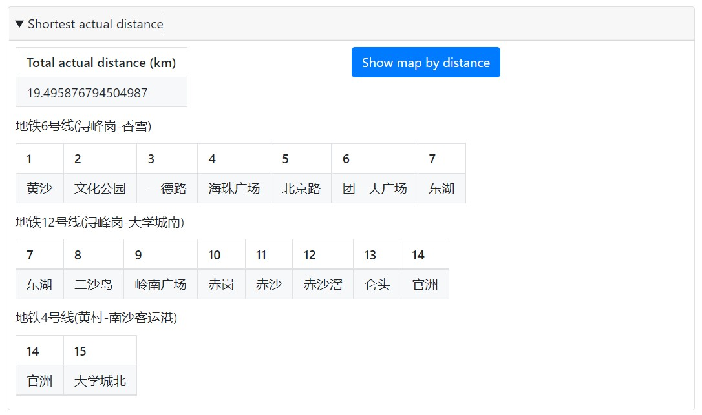

The shortest actual distance recommendation map

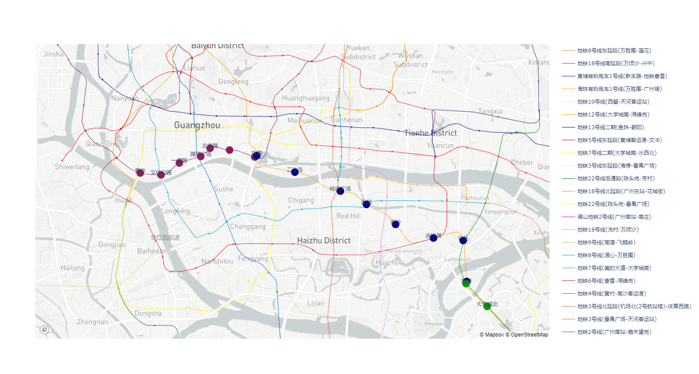

The Least number of station recommendation message

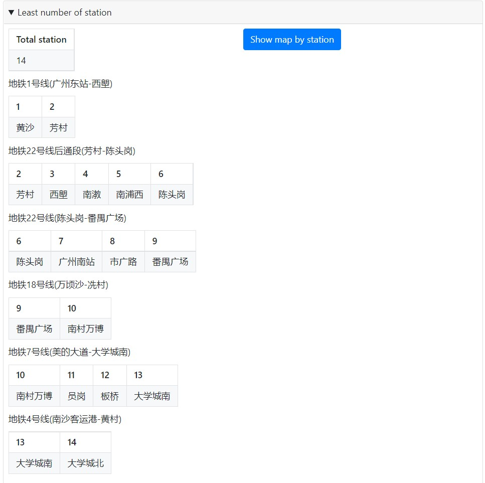

The Least number of station recommendation map

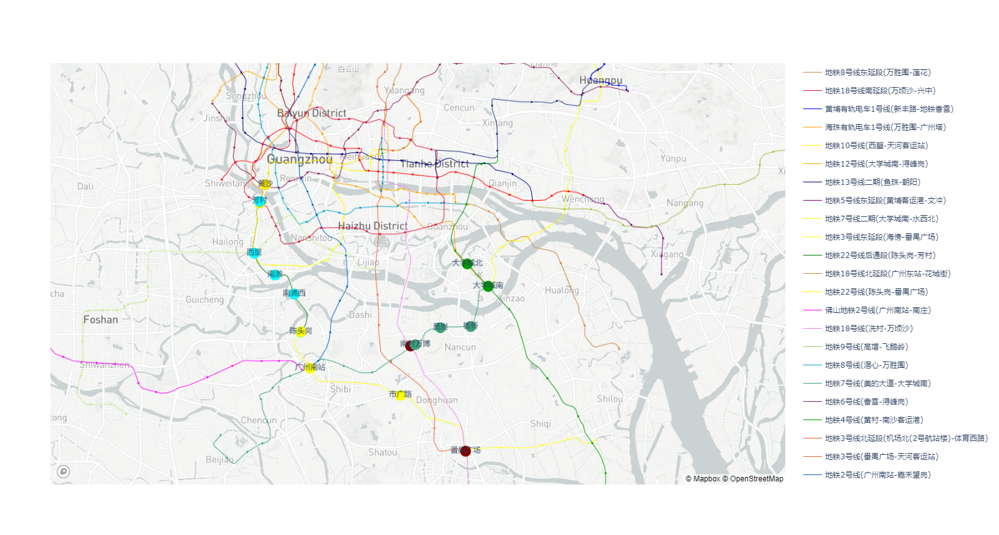

The Least number of transit station recommendation message

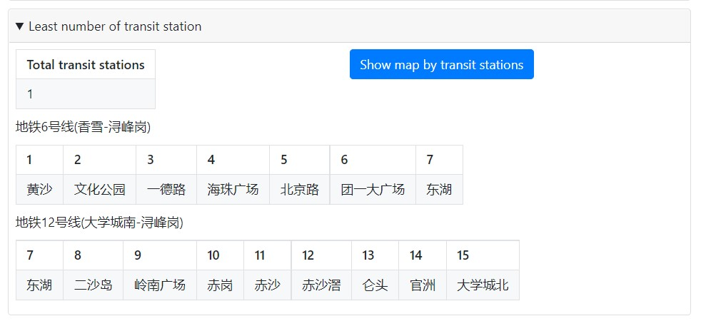

The Least number of transit station recommendation map

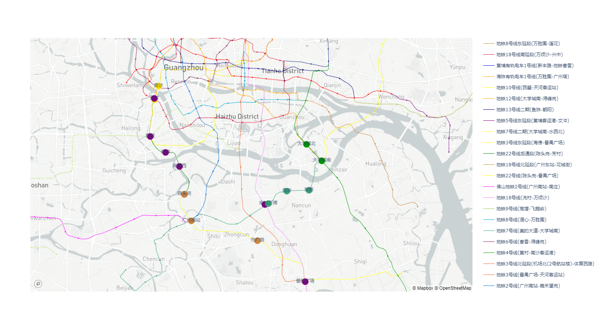

Last, you can click the reset button to input the station again.

**The program meets the requirements of this comprehensive experiment.**

### Summary 

The algorithm of this system does not have many characteristics. Algorithms and data structures are relatively efficient. Double Breadth First Search can be used to reduce the time complexity of the algorithm when planning the route with the least transfer stations. I think the system more outstanding that its interactive mode is more intuitive, and can draw real-time circuit diagram. The system can also easily switch to the subway line map of all cities in the country, the system  has high reusability. In addition, the system also encapsulates the line drawing device, which can be reused quickly when drawing other types of line drawing except subway.
I think this course is better taught in C/C++, and python's over-encapsulation makes the implementation of algorithms very slow. In contrast, the Pointers and actionable memory features of C/C++ help us understand and learn data structures.